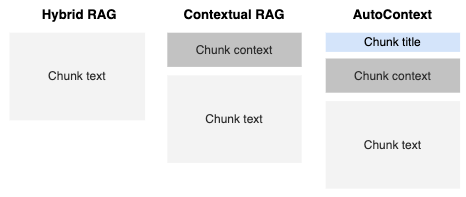

# RAG4QA

This repository compares different RAG approaches for Question Answering. 

Comparing Hybrid RAG and Contextual RAG, including the chunk context when presenting the search results to the LLM is beneficial as it gives the LLM more context, and makes it less likely that it misunderstands the meaning of a chunk.
However, adding a chunk title does not lead to any improvements.

  

