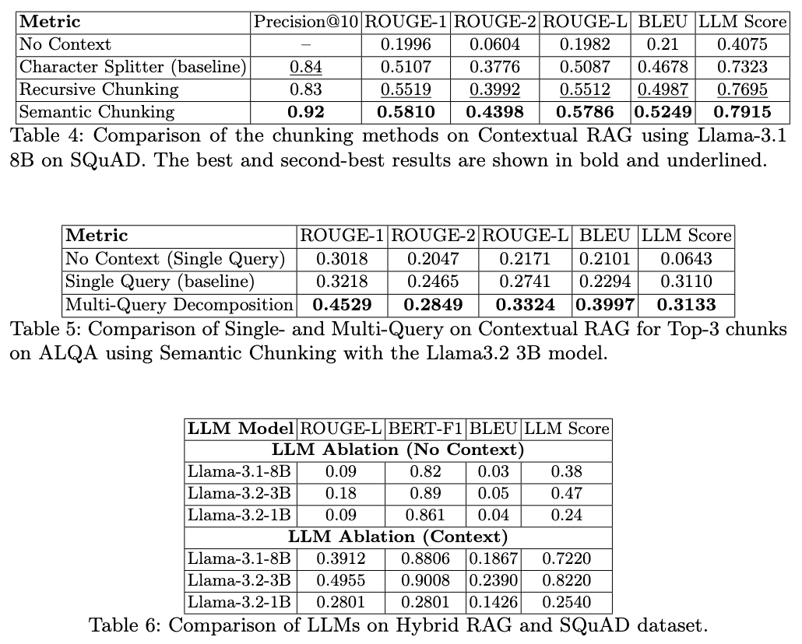

# RAG for Question Answering

This repository compares various Retrieval-Augmented Generation (RAG) approaches for Question Answering (QA), developed as part of the Information Retrieval lab at the University of Bonn from October 2024 to January 2025.

  

## Performance Evaluation

  

(SQuAD: The Stanford Question Answering Dataset, ALQA: Australian Legal Question Answering Dataset)
