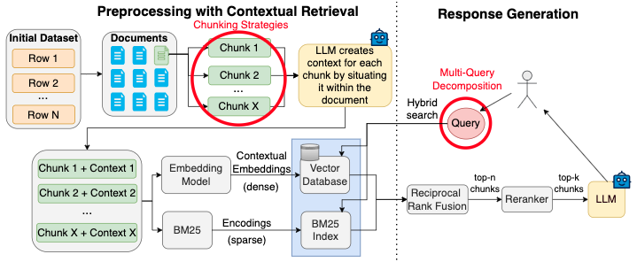
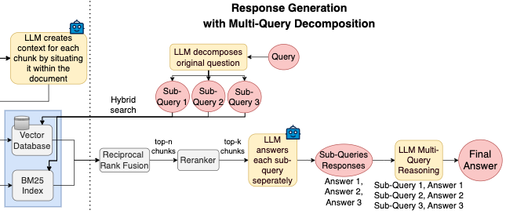
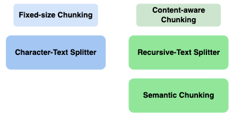

# ContextualRAG

This work is based on https://www.anthropic.com/news/contextual-retrieval (last accessed 01/17/2025).

Overview of the Contextual RAG pipeline divided into contextual retrieval and response generation. This work’s contributions are highlighted in red:




A refined response generation pipeline with advanced multi-query decomposition:



## Setup
```bash
python3 -m venv env
source env/bin/activate
pip install --upgrade pip
pip install -r requirements.txt
```
## How to run
```bash
python ['PATH/TO/MODEL']
```
Example:
```bash
python src/with_context/squad_rag.py
```
To save output in file:
```bash
python src/with_context/squad_rag.py > output/results.txt
```

## Datasets
- [The Stanford Question Answering Dataset (SQuAD)](https://huggingface.co/datasets/rajpurkar/squad)  
- [Australian Legal Question Answering Dataset (ALQA)](https://huggingface.co/datasets/Ramitha/open-australian-legal-qa-simplified-sent-tokenized)  

## LLM-Models
- Llama-3.2 3B
- Llama-3.2 1B
- Llama-3.1 8B
- Mistral-7B-v0.3
- Qwen-2.5 0.5B

## Embedding-Models
- sentence-transformers/all-mini-L12-v2 (base)
- sentence-transformers/all-mpnet-base-v2 (mpnet)
- sentence-transformers/multi-qa-mpnet-base-dot-v1 (multi_qa)

## Reranker-Models
- cross-encoder/ms-marco-MiniLM-L-12-v2
- cross-encoder/qnli-distilroberta-base

## Chunking Strategies
I tested different chunking stragies:
- Character Text splitter
- Recursive Chunking
- Semantic Chunking



Semantic chunking is taken from Greg Kamradt's notebook: ['5_Levels_Of_Text_Splitting'](https://github.com/FullStackRetrieval-com/RetrievalTutorials/blob/main/tutorials/LevelsOfTextSplitting/5_Levels_Of_Text_Splitting.ipynb) (last accessed: 01/17/2025).

## License

MIT License
